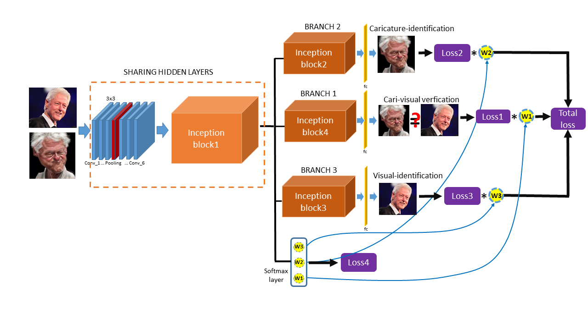
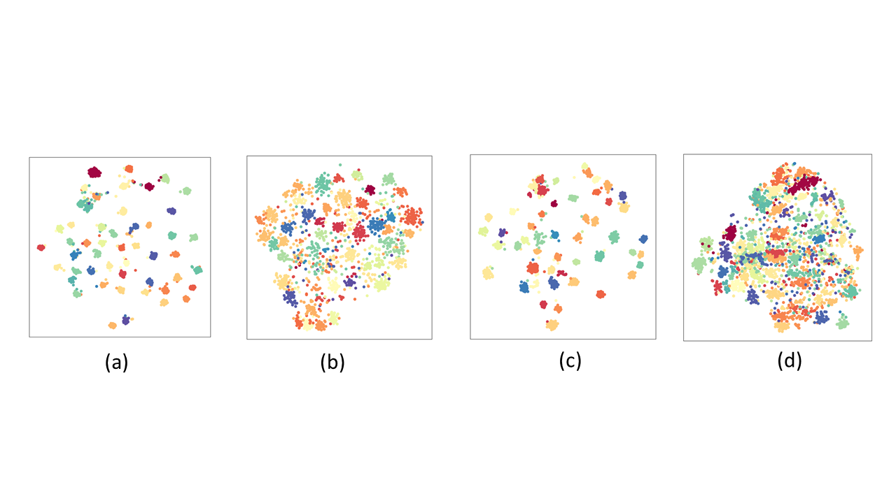

# Cross-model Caricature Face Recognitionvia Multi-task Learning
This is the implementation of the paper [Cross-model Caricature Face Recognition via Multi-task Learning](https://arxiv.org/pdf/1911.03341.pdf) published on the ICDAR workshop 2019 (GREC 2019), in which the caricature-visual image face verication, caricature face identication and the visual image face identication are conducted by the multi-task learning in the same deep CNNs with different branches. The weights of tasks can generate automatically with  a softmax like structure so called dynamic-weights-generating-unit according to the difficulty of the training of tasks which enable the networks always focus on the training of the hard task instead of the over-training easy task. No more hyperparameters are introduced for generating the dynamic weights. The demo is realized in TensorFlow1.6, Python 2.7 and openCV 3.0 under Unbuntu 16.4. The proposed architecture is shown in .

## Comparison of the different recognition modalities of real visual images and caricatures.
The different colors denote the different identities of the visual images or the caricatures. (a) is the classification results for the real visual images by the CNNs-based model trained on the real visual images (98.10\% of recognition accuracy); (b) is the classification results for the caricatures by the model of (a) (53.60\% of recognition accuracy); (c) is the classification results for the caricatures by the model trained on the caricatures (78.20\% of recognition accuracy) in which the architecture of the model is identical as (a); (d) is the classification results for the real visual images by the model of (c) (41.80\% of recognition accuracy). The visualisation is implemented by t-SNE as shown in is shown in .

## Dynamic weights in multi-task learning
The generating dynamic weights can automatically focus on the training of the hard task in the multi-task learning. The hard task with larger loss is always assigne with the larger weight of the task which force the networks to train the hard task primarily instead of the over-training of the easy task. In this way, the training of the multi-task is more efficient as shown in .

## Dependencies
- The code is tested on Ubuntu 16.04.

- install Tensorflow 1.6 (with GPU)

- install opencv 2.4.13.

- install python 2.7

## Pretrained model
The pretrained model of the face verifcation of the visual image on the large scale dataset [MSCeleb](https://www.msceleb.org/) is [here](https://drive.google.com/file/d/1B-ZRtWk1UoAQXHTewhKV5UPvwP3L102X/view?usp=sharing)

## Training
The cross-model caricature-visual face recogntion is trained on the  [CaVI](https://lsaiml.github.io/CaVINet/) and [WebCaricature](https://cs.nju.edu.cn/rl/WebCaricature.htm). The examples of the datasets are shown in 

## Face alignment
The face detection for the visual image is implemented by the [Multi-task CNN (Joint Face Detection and Alignment using Multi-task Cascaded Convolutional Networks).The paper for MTCNN)](https://kpzhang93.github.io/MTCNN_face_detection_alignment/index.html).

<!---
### Examples for command line:

Training the model (e.g. on dataset webcaricature):
python webcari_dynamic_L1L2L3_multimodel_v3_3weights_optimize_onelayer.py --logs_base_dir /data/zming/logs/cavi --models_base_dir /data/zming/models/cavi --data_dir /data/zming/datasets/WebCaricature/FaceDetected/ --image_size 160 --model_def ./models/inception_resnet_v1_cari_vis.py --optimizer RMSProp --learning_rate -1 --max_nrof_epochs 10000 --keep_probability 0.5 --learning_rate_schedule_file ../data/learning_rate_schedule_classifier_cavi.txt --weight_decay 5e-5 --center_loss_factor 1e-1 --center_loss_alfa 0.5 --gpu_memory_fraction 0.75 --epoch_size 100 --batch_size 256 --pretrained_model /data/zming/models/expression/20180113-231253/best_model --lfw_dir /data/zming/datasets/lfw/lfw_mtcnnpy_160 --nfold 10 --ifold 4 --learning_rate_decay_epochs 5 --train_pairs /data/zming/datasets/WebCaricature/Evaluation/FaceVerification/Restricted/RestrictedView1_DevTrain.txt --test_pairs /data/zming/datasets/WebCaricature/Evaluation/FaceVerification/Restricted/RestrictedView1_DevTest.txt
-->

## parameters:
--logs_base_dir, --models_base_dir: the path to save the log and training model  
--data_dir: training images  
--train_pairs: the caricature-visual images for training given by the benchmark of webcaricatures  
--test_pairs: the caricature-visual images used for the evalution of the models following the different protocol  
--image_size: the required image size for training  
--model_def: the networks architecutre used in this work  
--optimizer: optimizer for the BP of the parameters of CNNs  
--learning_rate: setting of learning rate, if it is <0, the configuration file --learning_rate_schedule_file for setting the learning will be used  
--pretrained_model: the path to the pretrained model  
--center_loss_factor : centerloss weight in the full loss function  
More details can be checked in the scripts.

The evaluation of the model can conduct by the evaluate_cavi.py, evaluate_webcavi.py and evaluate_webcavi_identify.py

### Citation
        @inproceedings{ming2019dynamic,
          title={Dynamic Deep Multi-task Learning for Caricature-Visual Face Recognition},
          author={Ming, Zuheng and Burie, Jean-Christophe and Luqman, Muhammad Muzzamil},
          booktitle={2019 International Conference on Document Analysis and Recognition Workshops (ICDARW)},
          volume={1},
          pages={92--97},
          year={2019},
          organization={IEEE}
        }

### License
This code is distributed under MIT LICENSE

### Contact
Zuheng Ming
zuheng.ming@univ-lr.fr
